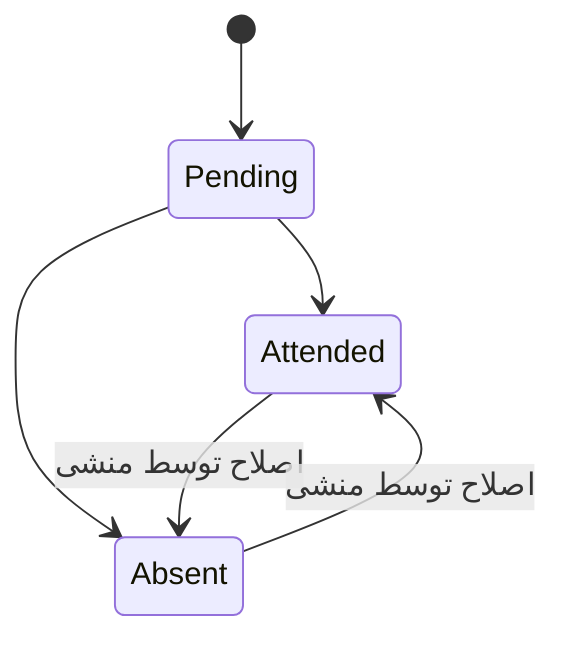

# قرارداد و راهنمای پیاده‌سازی بک‌اند دفترچه رزروهای منشی

## ۱. هدف

این سند قرارداد بک‌اند قابلیت **«دفترچه رزروها»** را تعریف می‌کند. منشی باید بتواند یک نوبت ساده را با نام، نام خانوادگی، تاریخ و ساعت ثبت کند و پس از زمان مراجعه، وضعیت بیمار را به «آمد» یا «نیامد» تغییر دهد.

این دفترچه با رزرو اصلی سامانه تفاوت دارد:

- برای ثبت سریع دستی است و به لید، مشاور یا پرونده بیمار وابسته نیست؛
- رکوردهای آن نباید به‌صورت خودکار وارد جدول `Reservations` شوند؛
- در صورت نیاز محصول، تبدیل رکورد دفترچه به رزرو اصلی باید با endpoint مستقل انجام شود؛
- داده باید بین مرورگرها و دستگاه‌های مجاز همگام باشد و پس از پاک‌شدن حافظه مرورگر از بین نرود.

## ۲. وضعیت فعلی فرانت‌اند و هدف مهاجرت

نسخه فعلی فرانت‌اند رکوردها را موقتاً در `localStorage` با کلید زیر نگه می‌دارد:

```text
secretary-reservation-notebook-v1
```

پس از آماده‌شدن API، فرانت‌اند باید خواندن و نوشتن اصلی را به endpointهای این سند منتقل کند. `localStorage` نباید منبع نهایی داده باقی بماند. برای جلوگیری از رکورد تکراری، مهاجرت داده‌های محلی باید فقط یک بار و با `clientId` ثابت انجام شود؛ جزئیات در بخش ۱۳ آمده است.

## ۳. نقش‌ها و سطح دسترسی

تمام endpointها باید `Authorization: Bearer {token}` داشته باشند.

| عملیات | Secretary | Admin | سایر نقش‌ها |
| --- | --- | --- | --- |
| مشاهده فهرست | مجاز | مجاز برای گزارش/پشتیبانی | غیرمجاز |
| ایجاد رکورد | مجاز | اختیاری بر اساس سیاست محصول | غیرمجاز |
| ویرایش مشخصات و زمان | مجاز | اختیاری | غیرمجاز |
| ثبت وضعیت حضور | مجاز | اختیاری | غیرمجاز |
| حذف نرم | مجاز | مجاز | غیرمجاز |

قواعد امنیتی:

1. `createdByUserId`، `updatedByUserId` و `attendanceMarkedByUserId` فقط از claim توکن استخراج شوند؛ بک‌اند نباید شناسه کاربر ارسالی از کلاینت را بپذیرد.
2. منشی اصلی (`Main`) می‌تواند تمام رکوردهای دفترچه کلینیک را ببیند.
3. اگر منشی‌ها باید فقط رکوردهای خود را ببینند، این سیاست باید در سمت سرور با `createdByUserId` اعمال شود؛ query ارسالی کلاینت قابل اعتماد نیست.
4. پیشنهاد می‌شود permission مستقل `ManageReservationNotebook` تعریف شود. تا زمان اضافه‌شدن آن، `ViewReservations` برای خواندن و `CreateReservation` برای ایجاد قابل استفاده است.

## ۴. مدل داده پیشنهادی

نام جدول پیشنهادی:

```text
SecretaryReservationNotebookEntries
```

### ۴-۱. ستون‌ها

| ستون | نوع پیشنهادی | Null | توضیح |
| --- | --- | --- | --- |
| `Id` | `bigint` / identity | خیر | کلید اصلی |
| `ClientId` | `varchar(64)` | بله | شناسه idempotency تولیدشده توسط کلاینت |
| `FirstName` | `nvarchar(50)` | خیر | نام بیمار |
| `LastName` | `nvarchar(50)` | خیر | نام خانوادگی بیمار |
| `ReservationAtUtc` | `datetimeoffset` | خیر | زمان استاندارد UTC |
| `TimeZone` | `varchar(64)` | خیر | پیش‌فرض `Asia/Tehran` |
| `AttendanceStatus` | `tinyint` | خیر | وضعیت حضور؛ پیش‌فرض `1` |
| `AttendanceMarkedAtUtc` | `datetimeoffset` | بله | زمان ثبت آخرین وضعیت حضور |
| `AttendanceMarkedByUserId` | نوع کلید کاربر | بله | کاربر ثبت‌کننده وضعیت |
| `CreatedByUserId` | نوع کلید کاربر | خیر | سازنده رکورد |
| `CreatedAtUtc` | `datetimeoffset` | خیر | زمان ایجاد |
| `UpdatedByUserId` | نوع کلید کاربر | بله | آخرین ویرایش‌کننده |
| `UpdatedAtUtc` | `datetimeoffset` | خیر | برای concurrency و مرتب‌سازی |
| `RowVersion` | `rowversion` | خیر | کنترل هم‌زمانی خوش‌بینانه |
| `IsDeleted` | `bit` | خیر | حذف نرم؛ پیش‌فرض `false` |
| `DeletedAtUtc` | `datetimeoffset` | بله | زمان حذف |
| `DeletedByUserId` | نوع کلید کاربر | بله | حذف‌کننده |

ایندکس‌های پیشنهادی:

```sql
CREATE INDEX IX_SecretaryNotebook_ReservationAt
ON SecretaryReservationNotebookEntries (ReservationAtUtc, IsDeleted);

CREATE INDEX IX_SecretaryNotebook_CreatedBy
ON SecretaryReservationNotebookEntries (CreatedByUserId, CreatedAtUtc DESC);

CREATE UNIQUE INDEX UX_SecretaryNotebook_ClientId_CreatedBy
ON SecretaryReservationNotebookEntries (CreatedByUserId, ClientId)
WHERE ClientId IS NOT NULL;
```

## ۵. وضعیت حضور

```text
SecretaryNotebookAttendanceStatus
1 = Pending
2 = Attended
3 = Absent
```

| مقدار | JSON | برچسب فرانت |
| --- | --- | --- |
| `1` | `pending` | ثبت‌نشده |
| `2` | `attended` | آمد |
| `3` | `absent` | نیامد |

در قرارداد JSON استفاده از string توصیه می‌شود تا خوانایی بیشتر شود. مقدار دیتابیس می‌تواند عددی باشد. مقدار ناشناخته نباید به `pending` تبدیل شود و باید خطای اعتبارسنجی ایجاد کند.

انتقال‌های مجاز:



اصلاح وضعیت مجاز است، اما هر تغییر باید در audit log ثبت شود.

## ۶. قرارداد مشترک پاسخ

پاسخ موفق مطابق الگوی فعلی پروژه باشد:

```json
{
  "isSuccess": true,
  "message": "رکورد دفترچه با موفقیت ثبت شد",
  "data": {}
}
```

خطاهای اعتبارسنجی با `400 Bad Request` و ساختار زیر ارسال شوند:

```json
{
  "isSuccess": false,
  "message": "اطلاعات واردشده معتبر نیست",
  "errors": {
    "firstName": ["نام بیمار الزامی است"],
    "reservationDate": ["تاریخ شمسی معتبر نیست"]
  }
}
```

نام فیلدهای JSON فقط `camelCase` باشد؛ ارسال نسخه PascalCase لازم نیست.

## ۷. دریافت فهرست

```http
GET /api/SecretaryReservationNotebook?pageNumber=1&pageSize=20&createdByUserId=1ec7c560-2222-4444-9999-a12345678900
Authorization: Bearer {token}
```

پارامترها:

| پارامتر | نوع | پیش‌فرض / قاعده |
| --- | --- | --- |
| `pageNumber` | integer | پیش‌فرض ۱؛ حداقل ۱ |
| `pageSize` | integer | پیش‌فرض ۲۰؛ حداکثر ۱۰۰ |
| `createdByUserId` | string | شناسه منشی انتخاب‌شده؛ اختیاری، برای گزینه «همه منشی‌ها» ارسال نشود |

در این نسخه، **تنها فیلتر محصول نام منشی است**. بک‌اند نباید فیلتر تاریخ، وضعیت، نام بیمار یا فیلتر دیگری را به قرارداد این صفحه اضافه کند. گزینه‌های dropdown از endpoint زیر دریافت شوند و فقط منشی‌هایی را برگردانند که کاربر جاری مجاز به دیدن یادداشت‌های آن‌ها است:

```http
GET /api/SecretaryReservationNotebook/secretaries
Authorization: Bearer {token}
```

```json
{
  "isSuccess": true,
  "message": "فهرست منشی‌ها دریافت شد",
  "data": [
    { "userId": "1ec7c560-2222-4444-9999-a12345678900", "displayName": "مریم احمدی" }
  ]
}
```

مقدار `createdByUserId` باید حتماً با scope دسترسی کاربر جاری اعتبارسنجی شود. منشی عادی در صورت محدودبودن سیاست دسترسی فقط شناسه خودش را دریافت می‌کند؛ منشی اصلی می‌تواند بین منشی‌های مجاز انتخاب کند.

پاسخ:

```json
{
  "isSuccess": true,
  "message": "دفترچه رزروها دریافت شد",
  "data": {
    "items": [
      {
        "id": 125,
        "firstName": "سارا",
        "lastName": "احمدی",
        "reservationAt": "2026-08-23T06:30:00Z",
        "reservationDatePersian": "1405/06/01",
        "reservationTime": "10:00",
        "timeZone": "Asia/Tehran",
        "attendanceStatus": "pending",
        "attendanceMarkedAt": null,
        "createdAt": "2026-08-22T05:20:00Z",
        "updatedAt": "2026-08-22T05:20:00Z",
        "createdByDisplayName": "منشی کلینیک",
        "rowVersion": "AAAAAAAAB9E="
      }
    ],
    "pageNumber": 1,
    "pageSize": 20,
    "totalCount": 1,
    "totalPages": 1
  }
}
```

فیلد `reservationDatePersian` صرفاً برای نمایش است؛ منبع محاسبات و مرتب‌سازی باید `reservationAt` باشد.

## ۸. ایجاد رکورد

```http
POST /api/SecretaryReservationNotebook
Authorization: Bearer {token}
Content-Type: application/json
Idempotency-Key: 66c88123-795b-41bd-a362-586b71c98a85
```

```json
{
  "clientId": "66c88123-795b-41bd-a362-586b71c98a85",
  "firstName": "سارا",
  "lastName": "احمدی",
  "reservationDatePersian": "1405/06/01",
  "reservationTime": "10:00",
  "timeZone": "Asia/Tehran"
}
```

قواعد اعتبارسنجی:

- `firstName` و `lastName` بعد از `Trim` اجباری و حداکثر ۵۰ کاراکتر باشند؛
- ورودی فقط شامل فاصله معتبر نیست؛
- تاریخ جلالی باید واقعاً وجود داشته باشد؛ مقادیری مثل `1405/13/01` یا `1405/02/32` رد شوند؛
- زمان باید قالب ۲۴ ساعته `HH:mm` داشته باشد؛
- منطقه زمانی فقط از allow-list سامانه پذیرفته شود و مقدار عادی `Asia/Tehran` باشد؛
- بک‌اند تاریخ جلالی و ساعت محلی را یک بار به UTC تبدیل و در `ReservationAtUtc` ذخیره کند؛
- ثبت زمان گذشته، مطابق تصمیم محصول، می‌تواند مجاز باشد تا منشی یادداشت‌های همان روز را تکمیل کند. پیشنهاد: تا ۷ روز گذشته مجاز و قدیمی‌تر رد شود؛
- پاسخ موفق `201 Created` به همراه رکورد کامل و header مکان منبع برگرداند.

ارسال دوباره `clientId` یکسان برای همان کاربر نباید رکورد دوم بسازد؛ همان رکورد قبلی با `200 OK` برگردانده شود.

## ۹. ویرایش مشخصات یا زمان

```http
PUT /api/SecretaryReservationNotebook/{id}
Authorization: Bearer {token}
If-Match: "AAAAAAAAB9E="
```

```json
{
  "firstName": "سارا",
  "lastName": "احمدی",
  "reservationDatePersian": "1405/06/02",
  "reservationTime": "11:30",
  "timeZone": "Asia/Tehran",
  "rowVersion": "AAAAAAAAB9E="
}
```

- فقط سازنده یادداشت (`CreatedByUserId`) مجاز به ویرایش آن است؛ برای سایر منشی‌ها پاسخ `403 Forbidden` برگردد، حتی اگر رکورد را در فهرست مشاهده می‌کنند.
- همان اعتبارسنجی ایجاد اعمال شود.
- در تعارض `rowVersion` پاسخ `409 Conflict` داده شود و نسخه فعلی رکورد داخل `data.currentItem` برگردد.
- ویرایش مشخصات نباید وضعیت حضور را بدون درخواست صریح تغییر دهد.

## ۱۰. ثبت «آمد/نیامد»

```http
PATCH /api/SecretaryReservationNotebook/{id}/attendance
Authorization: Bearer {token}
If-Match: "AAAAAAAAB9E="
```

```json
{
  "attendanceStatus": "attended",
  "rowVersion": "AAAAAAAAB9E="
}
```

یا:

```json
{
  "attendanceStatus": "absent",
  "rowVersion": "AAAAAAAAB9E="
}
```

قواعد:

1. فقط `attended` و `absent` در این endpoint پذیرفته شوند؛ بازگرداندن به `pending` در UI فعلی لازم نیست.
2. `attendanceMarkedAt` از ساعت سرور و `attendanceMarkedByUserId` از توکن پر شود.
3. endpoint باید رکورد کامل به‌روزشده و `rowVersion` جدید را برگرداند.
4. تغییر تکراری به همان وضعیت idempotent است و نباید audit تکراری تولید کند.
5. ثبت وضعیت پیش از زمان رزرو بهتر است با `400` رد شود؛ اگر محصول نیاز به پیش‌ثبت دارد این قانون باید صریحاً حذف شود.

## ۱۱. حذف رکورد

```http
DELETE /api/SecretaryReservationNotebook/{id}
Authorization: Bearer {token}
If-Match: "AAAAAAAAB9E="
```

- فقط سازنده یادداشت یا ادمین مجاز به حذف آن است.
- حذف باید نرم باشد (`IsDeleted = true`).
- پاسخ موفق `204 No Content` باشد.
- حذف مجدد همان رکورد می‌تواند idempotent و `204` باشد.
- رکورد حذف‌شده در endpoint عادی فهرست نمایش داده نشود.
- بازیابی رکورد حذف‌شده فقط در پنل ادمین و endpoint جداگانه انجام شود.

## ۱۲. Audit log

برای پیگیری تغییرات، جدول عمومی activity یا جدول زیر استفاده شود:

```text
SecretaryReservationNotebookActivities
```

حداقل فیلدها:

- `Id`
- `NotebookEntryId`
- `Action`: `Created`, `Updated`, `AttendanceChanged`, `Deleted`
- `PreviousValueJson`
- `NewValueJson`
- `ActorUserId`
- `CreatedAtUtc`

اطلاعات حساس غیرضروری در JSON audit ذخیره نشود. تغییر وضعیت باید مقدار قبلی و جدید را نگه دارد.

## ۱۳. مهاجرت داده فعلی localStorage

برای انتقال رکوردهای نسخه فعلی می‌توان endpoint گروهی زیر را فقط در یک دوره گذار ارائه کرد:

```http
POST /api/SecretaryReservationNotebook/import
Authorization: Bearer {token}
```

```json
{
  "items": [
    {
      "clientId": "79a8f379-a5fb-4f05-8f43-e6ef97e52f10",
      "firstName": "سارا",
      "lastName": "احمدی",
      "reservationDatePersian": "1405/06/01",
      "reservationTime": "10:00",
      "attendanceStatus": "attended"
    }
  ]
}
```

قواعد import:

- حداکثر ۱۰۰ رکورد در هر درخواست؛
- هر آیتم مستقل اعتبارسنجی شود؛
- `clientId` به‌عنوان کلید idempotency استفاده شود؛
- پاسخ شامل تعداد `createdCount`، `duplicateCount` و خطاهای هر index باشد؛
- پس از موفقیت کامل، فرانت کلید محلی را حذف یا با کلید `secretary-reservation-notebook-migrated-v1` علامت‌گذاری کند؛
- اگر import نیمه‌موفق بود، فرانت فقط آیتم‌های موفق را محلی علامت بزند و ارسال همه موارد بدون `clientId` ثابت را تکرار نکند.

نمونه پاسخ:

```json
{
  "isSuccess": true,
  "message": "داده‌های دفترچه بررسی و منتقل شدند",
  "data": {
    "createdCount": 9,
    "duplicateCount": 1,
    "failedCount": 1,
    "errors": [
      { "index": 4, "clientId": "...", "message": "تاریخ معتبر نیست" }
    ]
  }
}
```

## ۱۴. خروجی اکسل

```http
GET /api/SecretaryReservationNotebook/export?createdByUserId=1ec7c560-2222-4444-9999-a12345678900
Authorization: Bearer {token}
Accept: application/vnd.openxmlformats-officedocument.spreadsheetml.sheet
```

این endpoint باید دقیقاً همان فیلتر منشی را که روی فهرست اعمال شده دریافت کند. هیچ فیلتر اضافی برای خروجی اکسل تعریف نشود. اگر `createdByUserId` ارسال نشود، تمام یادداشت‌هایی که کاربر جاری مجاز به مشاهده آن‌ها است صادر شوند.

قواعد فایل:

- خروجی واقعی `.xlsx` با Content-Type بالا تولید شود؛ SpreadsheetML قدیمی `.xls` فقط fallback موقت فرانت‌اند است؛
- نام فایل در `Content-Disposition` مانند `secretary-reservation-notebook-2026-08-22.xlsx` باشد؛
- ستون‌ها فقط شامل «نام»، «نام خانوادگی»، «تاریخ»، «ساعت»، «وضعیت حضور» و «منشی ثبت‌کننده» باشند؛
- عنوان ستون‌ها فارسی، sheet راست‌به‌چپ و ردیف عنوان freeze شود؛
- تاریخ به شکل جلالی `yyyy/MM/dd` و ساعت `HH:mm` نوشته شود؛
- تولید فایل باید در سمت سرور streaming باشد و محدودیت تعداد رکورد معقول داشته باشد؛ برای عبور از سقف پاسخ `400` با پیام قابل نمایش برگردد؛
- scope دسترسی مانند endpoint فهرست روی خروجی نیز اعمال شود؛ تغییر query نباید امکان دریافت یادداشت منشی غیرمجاز را بدهد.

فرانت‌اند پس از آماده‌شدن این endpoint باید export موقت SpreadsheetML را با دانلود blob پاسخ API جایگزین کند.

## ۱۵. کدهای وضعیت HTTP

| کد | کاربرد |
| --- | --- |
| `200` | دریافت، ویرایش یا درخواست idempotent موفق |
| `201` | ایجاد موفق |
| `204` | حذف موفق |
| `400` | ورودی نامعتبر یا انتقال وضعیت غیرمجاز |
| `401` | توکن وجود ندارد یا معتبر نیست |
| `403` | کاربر permission لازم ندارد |
| `404` | رکورد وجود ندارد یا در scope کاربر نیست |
| `409` | تعارض `rowVersion` یا ویرایش هم‌زمان |
| `429` | عبور از rate limit |
| `500` | خطای پیش‌بینی‌نشده سرور؛ بدون افشای جزئیات داخلی |

## ۱۶. ملاحظات فنی و امنیتی

- تاریخ و زمان در دیتابیس UTC ذخیره و در مرز API به زمان تهران تبدیل شود.
- تبدیل جلالی با کتابخانه تست‌شده انجام شود؛ تبدیل دستی تاریخ توصیه نمی‌شود.
- روی تمام رشته‌ها `Trim`، محدودیت طول و normalization یونیکد اعمال شود؛ تفاوت `ی/ي` و `ک/ك` در جست‌وجو normalize شود.
- query فهرست باید pagination سمت سرور داشته باشد و تمام داده‌ها یکجا برنگردند.
- rate limit پیشنهادی برای commandها: ۶۰ درخواست در دقیقه برای هر کاربر.
- endpoint حذف، ویرایش و حضور باید در transaction کوتاه شامل update و audit اجرا شود.
- لاگ برنامه نباید نام کامل بیمار را بدون نیاز عملیاتی ثبت کند.
- رکوردهای دفترچه شامل داده شخصی هستند و باید مطابق سیاست نگهداری داده سامانه پس از مدت مشخص پاک یا anonymize شوند.

## ۱۷. تست‌های الزامی بک‌اند

### Unit test

- تبدیل تاریخ معتبر جلالی و ساعت تهران به UTC؛
- رد ماه ۱۳، روز نامعتبر و ساعت نامعتبر؛
- رد نام خالی یا فقط فاصله؛
- نگاشت enum دیتابیس به string قرارداد؛
- normalization حروف فارسی/عربی در نام‌های ذخیره‌شده.

### Integration test

- ایجاد، دریافت، ویرایش، حضور و حذف کامل یک رکورد؛
- جلوگیری از ایجاد تکراری با `clientId` یکسان؛
- پاسخ `409` برای `rowVersion` قدیمی؛
- عدم دسترسی نقش‌های غیرمجاز؛
- عدم نمایش رکورد حذف‌شده؛
- pagination و فیلتر نام منشی با `createdByUserId`؛
- ثبت audit برای تغییر واقعی و عدم ثبت audit تکراری برای درخواست idempotent؛
- import نیمه‌موفق و اجرای مجدد امن؛
- دریافت گزینه‌های dropdown فقط در scope مجاز؛
- اعمال فیلتر `createdByUserId` روی فهرست و خروجی اکسل؛
- پاسخ `403` هنگام ویرایش یادداشت منشی دیگر؛
- اعتبارسنجی نام فایل، Content-Type و ستون‌های فایل `.xlsx`.

## ۱۸. چک‌لیست تحویل به فرانت‌اند

- [ ] migration جدول اصلی و جدول audit اجرا شده است.
- [ ] permission و policy دسترسی منشی تعریف شده است.
- [ ] endpoint فهرست با pagination و تنها فیلتر `createdByUserId` آماده است.
- [ ] endpoint گزینه‌های dropdown منشی‌ها با scope دسترسی آماده است.
- [ ] ایجاد با `clientId` و idempotency آماده است.
- [ ] ویرایش با optimistic concurrency آماده است.
- [ ] endpoint ثبت حضور `attended/absent` آماده است.
- [ ] حذف نرم آماده است.
- [ ] import داده‌های localStorage آماده یا درباره حذف آن تصمیم‌گیری شده است.
- [ ] endpoint خروجی واقعی `.xlsx` با فیلتر منشی آماده است.
- [ ] Swagger شامل schema، enumها و مثال پاسخ است.
- [ ] تمام تاریخ‌های UTC با پسوند `Z` یا offset معتبر ارسال می‌شوند.
- [ ] نام فیلدهای JSON با همین سند و به‌صورت `camelCase` نهایی شده‌اند.
- [ ] تست‌های integration در CI سبز هستند.

## ۱۹. ترتیب پیشنهادی اتصال فرانت به API

1. تعریف DTO و متدهای API در `SecretaryDashboardService`؛
2. اجرای import یک‌باره اطلاعات محلی؛
3. جایگزینی `readReservations()` با endpoint فهرست؛
4. جایگزینی `localStorage.setItem` در ایجاد، حضور و حذف با commandهای API؛
5. نمایش loading، خطای شبکه و دکمه تلاش مجدد؛
6. ارسال `rowVersion` در ویرایش/حذف/ثبت حضور و مدیریت `409`؛
7. نگه‌داشتن localStorage فقط به‌عنوان migration source و حذف آن پس از دوره گذار.
8. جایگزینی SpreadsheetML موقت با دانلود blob از endpoint خروجی اکسل.
