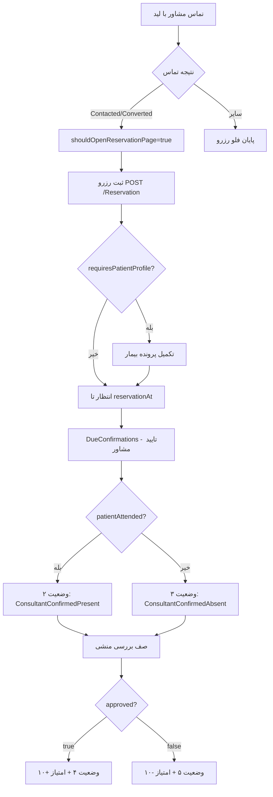
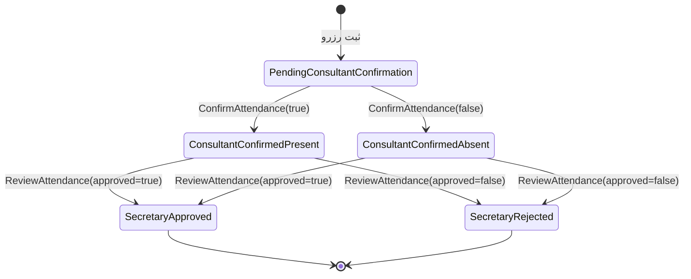

# مستند جامع پیاده‌سازی فرانت: رزرو و تایید حضور

> این سند مرجع اصلی تیم فرانت برای پیاده‌سازی کامل فلو رزرو، تایید حضور مشاور، بررسی منشی و امتیازدهی است.
> برای API خام به [RESERVATION_API_DOCUMENTATION.md](../RESERVATION_API_DOCUMENTATION.md) مراجعه کنید.

## فهرست

1. [خلاصه بیزینسی](#خلاصه-بیزینسی)
2. [نقش‌ها و مسئولیت صفحات](#نقش‌ها-و-مسئولیت-صفحات)
3. [جریان end-to-end](#جریان-end-to-end)
4. [State Machine وضعیت حضور](#state-machine-وضعیت-حضور)
5. [TypeScript Types](#typescript-types)
6. [صفحات مشاور](#صفحات-مشاور)
7. [صفحات منشی](#صفحات-منشی)
8. [مرجع API](#مرجع-api)
9. [منطق فعال/غیرفعال دکمه‌ها](#منطق-فعالغیرفعال-دکمه‌ها)
10. [سناریوهای کاربری](#سناریوهای-کاربری)
11. [مدیریت خطا](#مدیریت-خطا)
12. [Polling و رفرش](#polling-و-رفرش)
13. [چک‌لیست فازبندی](#چک‌لیست-فازبندی)
14. [پیاده‌سازی Service در Angular](#پیاده‌سازی-service-در-angular)

---

## خلاصه بیزینسی

### قوانین رزرو

| قانون | توضیح |
| --- | --- |
| شرط ثبت رزرو | فقط بعد از تماس موفق (`Contacted=1` یا `Converted=2`) و `shouldOpenReservationPage=true` |
| زمان رزرو | `reservationAt` باید در آینده باشد (ISO 8601) |
| فیلدهای اجباری ثبت | `patientCity`، `attendancePrediction`، `attendanceProbabilityPercent` (۰–۱۰۰) |
| پرونده بیمار | اگر `requiresPatientProfile=true` باشد، دیالوگ تکمیل پرونده باید باز شود |
| ظرفیت لید لحظه‌ای | تا `DueConfirmations` خالی نشود، لید realtime قفل است |

### امتیازدهی حضور

| رویداد | امتیاز |
| --- | --- |
| منشی `approved=true` | **+۱۰** |
| منشی `approved=false` | **-۱۰** |

امتیاز بعد از `ReviewAttendance` روی فیلدهای `isAttendanceScoreApplied`، `attendanceScoreValue` و `attendanceScoreAppliedAt` در response قابل نمایش است.

---

## نقش‌ها و مسئولیت صفحات

### مشاور

| صفحه/بخش | مسئولیت |
| --- | --- |
| ثبت گزارش تماس | ارسال شهر، احتمال حضور، نتیجه تماس |
| دیالوگ ثبت رزرو | تاریخ/ساعت، شهر، پیش‌بینی حضور |
| تب «در انتظار تایید» | `DueConfirmations` + دکمه‌های «بیمار آمد/نیامد» |
| تب «همه» | `GetConsultantReservations` |
| تب «انجام‌شده» | `onlySecretaryReviewed=true` + نمایش امتیاز |
| قفل لید لحظه‌ای | نمایش هشدار در صفحه لیدها تا تایید حضورهای موعددار |

### منشی

| صفحه/بخش | مسئولیت |
| --- | --- |
| تب «صف بررسی» | `onlyWaitingForSecretaryReview=true&onlyDue=true` |
| تب «همه» | `searchText` + فیلتر وضعیت |
| تب «انجام‌شده» | وضعیت ۴ یا ۵ + نمایش امتیاز |
| تکمیل پرونده | `CompletePatientProfile` برای `requiresPatientProfile=true` |
| بررسی ادعای مشاور | `ReviewAttendance` با `approved` و یادداشت |

---

## جریان end-to-end



---

## State Machine وضعیت حضور

### Enum

```typescript
export enum AttendanceConfirmationStatus {
  PendingConsultantConfirmation = 1,
  ConsultantConfirmedPresent = 2,
  ConsultantConfirmedAbsent = 3,
  SecretaryApproved = 4,
  SecretaryRejected = 5,
}
```

### برچسب فارسی و رنگ badge

| عدد | نام | برچسب UI | کلاس badge |
| --- | --- | --- | --- |
| 1 | PendingConsultantConfirmation | منتظر تایید مشاور | `muted` |
| 2 | ConsultantConfirmedPresent | مشاور: بیمار آمده | `success` |
| 3 | ConsultantConfirmedAbsent | مشاور: بیمار نیامده | `warn` |
| 4 | SecretaryApproved | تایید نهایی منشی | `success` |
| 5 | SecretaryRejected | رد نهایی منشی | `danger` |

### دیاگرام انتقال



پیاده‌سازی مشترک: `src/app/core/reservation/reservation-attendance.ts`

---

## TypeScript Types

```typescript
export interface ConsultantReservation {
  id: number;
  leadAssignmentId: number;
  consultantProfileId: number;
  patientUserId: string | null;
  requiresPatientProfile: boolean;
  reservationAt: string;
  patientName: string;
  patientPhoneNumber: string;
  patientCity: string;
  attendanceProbabilityPercent: number;
  attendancePrediction: string;
  attendanceConfirmationStatus: AttendanceConfirmationStatus;
  consultantAttendanceConfirmedAt: string | null;
  consultantSaysPatientAttended: boolean | null;
  consultantAttendanceNote: string | null;
  secretaryReviewedAt: string | null;
  secretaryApprovedConsultantConfirmation: boolean | null;
  secretaryReviewNote: string | null;
  isAttendanceScoreApplied: boolean;
  attendanceScoreValue: number | null;
  isDueForConsultantConfirmation: boolean;
  isCanceled: boolean;
}

export interface CreateReservationRequest {
  leadAssignmentId: number;
  consultantProfileId: number;
  reservationAt: string;
  patientCity: string;
  attendanceProbabilityPercent: number;
  attendancePrediction: string;
  secondaryPhoneNumber?: string | null;
  description?: string | null;
}

export interface ConfirmAttendanceRequest {
  reservationId: number;
  consultantProfileId: number;
  patientAttended: boolean;
  note: string | null;
}

export interface ReviewAttendanceRequest {
  reservationId: number;
  secretaryUserId: string;
  approved: boolean;
  note: string | null;
}
```

---

## صفحات مشاور

### سه تب رزرو

| تب | Endpoint | Query |
| --- | --- | --- |
| در انتظار تایید | `GET /Reservation/DueConfirmations` | `consultantProfileId` |
| همه | `GET /Reservation/GetConsultantReservations` | `pageNumber`, `pageSize`, `includeCanceled=false` |
| انجام‌شده | `GET /Reservation/GetConsultantReservations` | `onlySecretaryReviewed=true` |

کامپوننت: `src/app/pages/consultant-dashboard/consultant-reservations-panel.component.ts`

### مودال تایید حضور (تب در انتظار)

- دکمه «بیمار آمد» → `ConfirmAttendance` با `patientAttended=true`
- دکمه «بیمار نیامد» → `ConfirmAttendance` با `patientAttended=false`
- یادداشت اختیاری در textarea

### Wireframe تب در انتظار

```text
┌─────────────────────────────────────────────┐
│ [در انتظار تایید] [همه] [انجام‌شده]  بروزرسانی │
├─────────────────────────────────────────────┤
│ علی احمدی - 0912... - تهران    [منتظر تایید] │
│ زمان: ۱۴۰۵/۰۴/۱۲ ۱۰:۳۰   احتمال: ۸۰٪         │
│ [یادداشت اختیاری________________]           │
│ [بیمار آمد]  [بیمار نیامد]                   │
└─────────────────────────────────────────────┘
```

---

## صفحات منشی

### سه تب

| تب | Query |
| --- | --- |
| صف بررسی | `onlyWaitingForSecretaryReview=true&onlyDue=true` |
| همه | `searchText` + `attendanceConfirmationStatus` (اختیاری) |
| انجام‌شده | `attendanceConfirmationStatus=4` و `5` (دو درخواست موازی و merge) |

کامپوننت: `src/app/pages/secretary-dashboard/secretary-reservations.component.ts`

### دکمه‌های بررسی

- «تایید ادعای مشاور (+۱۰)» → `approved=true`
- «رد ادعای مشاور (-۱۰)» → `approved=false`

---

## مرجع API

### مشاور

#### DueConfirmations

```http
GET /api/Reservation/DueConfirmations?consultantProfileId={id}
```

پاسخ: آرایه مستقیم (بدون pagination).

#### GetConsultantReservations

```http
GET /api/Reservation/GetConsultantReservations
  ?consultantProfileId={id}
  &onlySecretaryReviewed=true
  &includeCanceled=false
  &pageNumber=1
  &pageSize=20
```

#### ConfirmAttendance

```http
POST /api/Reservation/ConfirmAttendance
Content-Type: application/json

{
  "reservationId": 25,
  "consultantProfileId": 43,
  "patientAttended": true,
  "note": "بیمار در مطب حاضر شد."
}
```

### منشی

#### SecretaryReservations — صف بررسی

```http
GET /api/Reservation/SecretaryReservations
  ?onlyWaitingForSecretaryReview=true
  &onlyDue=true
  &includeCanceled=false
  &pageNumber=1
  &pageSize=20
```

#### SecretaryReservations — همه

```http
GET /api/Reservation/SecretaryReservations
  ?searchText=علی
  &attendanceConfirmationStatus=2
  &pageNumber=1
  &pageSize=20
```

#### ReviewAttendance

```http
POST /api/Reservation/ReviewAttendance

{
  "reservationId": 25,
  "secretaryUserId": "{guid}",
  "approved": true,
  "note": "با حضور بیمار تطبیق داده شد."
}
```

---

## منطق فعال/غیرفعال دکمه‌ها

```typescript
// مشاور — تایید حضور
function canConfirmAttendance(reservation: ConsultantReservation): boolean {
  return (
    !reservation.isCanceled &&
    reservation.attendanceConfirmationStatus ===
      AttendanceConfirmationStatus.PendingConsultantConfirmation
  );
}

// مشاور — تکمیل پرونده
function canCompletePatientProfile(reservation: ConsultantReservation): boolean {
  return (
    reservation.requiresPatientProfile &&
    !reservation.patientUserId &&
    !reservation.isCanceled
  );
}

// منشی — بررسی ادعا
function canReviewAttendance(item: SecretaryReservation): boolean {
  return (
    item.isWaitingForSecretaryReview === true ||
    item.attendanceConfirmationStatus ===
      AttendanceConfirmationStatus.ConsultantConfirmedPresent ||
    item.attendanceConfirmationStatus ===
      AttendanceConfirmationStatus.ConsultantConfirmedAbsent
  );
}

// قفل لید realtime
function shouldLockRealtimeLeads(dueCount: number): boolean {
  return dueCount > 0;
}
```

---

## سناریوهای کاربری

### ۱. فلو موفق (تماس → رزرو → حضور → تایید منشی)

1. مشاور گزارش تماس مثبت ثبت می‌کند.
2. رزرو با شهر و پیش‌بینی حضور ثبت می‌شود.
3. پرونده بیمار تکمیل می‌شود.
4. در زمان رزرو، رزرو در `DueConfirmations` ظاهر می‌شود.
5. مشاور «بیمار آمد» را می‌زند → وضعیت ۲.
6. منشی در صف بررسی تایید می‌کند → وضعیت ۴، امتیاز +۱۰.

### ۲. رد منشی

1. مشاور «بیمار آمد» می‌زند.
2. منشی «رد ادعای مشاور» → وضعیت ۵، امتیاز -۱۰.

### ۳. زودهنگام (قبل از reservationAt)

- رزرو در `DueConfirmations` نیست (`onlyDue` برای منشی هم false است).
- مشاور نمی‌تواند زودتر از موعد تایید کند.

### ۴. عدم حضور بیمار

1. مشاور «بیمار نیامد» → وضعیت ۳.
2. منشی بررسی می‌کند (تایید یا رد اظهار).

---

## مدیریت خطا

| HTTP / پیام | علت محتمل | اقدام UI |
| --- | --- | --- |
| 400 — زمان رزرو در گذشته | `reservationAt` نامعتبر | نمایش toast خطا، نگه داشتن دیالوگ |
| 400 — شهر الزامی است | `patientCity` خالی | هایلایت فیلد |
| 400 — پیش‌بینی حضور الزامی | `attendancePrediction` خالی | هایلایت فیلد |
| 400 — شماره موبایل متفاوت | پرونده با شماره لید همخوان نیست | readonly شماره در دیالوگ |
| 409 — قبلا تایید شده | وضعیت دیگر Pending نیست | رفرش لیست |
| 500 | خطای سرور | toast + دکمه بروزرسانی |
| `isSuccess: false` | پیام business در `message` | نمایش `message` |

---

## Polling و رفرش

| بخش | بازه پیشنهادی | شرط |
| --- | --- | --- |
| تب «در انتظار تایید» مشاور | ۱۵ ثانیه | پروفایل کامل |
| سایر تب‌های رزرو مشاور | ۳۰ ثانیه | پروفایل کامل |
| صف بررسی منشی | ۱۵ ثانیه | پروفایل کامل |
| سایر تب‌های منشی | ۳۰ ثانیه | پروفایل کامل |
| لیدهای realtime مشاور | ۱۰ ثانیه (آنلاین) / ۳۰ ثانیه | موجود در داشبورد |

هنگام `loading` یا `saving` polling رفرش نمی‌زند.

---

## چک‌لیست فازبندی

### فاز ۱ — Service و Types

- [x] `reservation-attendance.ts` با enum و helperها
- [x] فیلتر `onlySecretaryReviewed` در consultant service
- [x] فیلترهای `onlyDue` و `searchText` در secretary service
- [x] فیلدهای اجباری `CreateReservationRequest`

### فاز ۲ — UI مشاور

- [x] سه تب رزرو
- [x] تایید حضور در تب pending
- [x] نمایش امتیاز در تب completed
- [x] قفل لید از `DueConfirmations`

### فاز ۳ — UI منشی

- [x] سه تب یکپارچه
- [x] جستجو و فیلتر
- [x] بررسی ادعا با ±۱۰
- [x] تکمیل پرونده

### فاز ۴ — پایداری

- [x] Polling
- [x] مدیریت خطا و toast
- [x] build production

---

## پیاده‌سازی Service در Angular

### ConsultantDashboardService

مسیر: `src/app/core/consultant/consultant-dashboard.service.ts`

```typescript
getDueConfirmations(consultantProfileId: number): Observable<ConsultantReservation[]>
getReservations(filters: ReservationFilters): Observable<PaginatedResponse<ConsultantReservation>>
confirmAttendance(payload: ConfirmAttendanceRequest): Observable<ApiCommandResponse>
createReservation(payload: CreateReservationRequest): Observable<ApiCommandResponse>
```

### SecretaryDashboardService

مسیر: `src/app/core/secretary/secretary-dashboard.service.ts`

```typescript
getReservations(filters: SecretaryReservationFilters): Observable<PaginatedResponse<SecretaryReservation>>
getAttendanceReviews(pageNumber, pageSize): Observable<PaginatedResponse<SecretaryReservation>>
reviewAttendance(payload: ReviewAttendanceRequest): Observable<ApiCommandResponse>
completePatientProfile(payload: CompletePatientProfileRequest): Observable<ApiCommandResponse>
```

### نمونه فیلتر تب انجام‌شده مشاور

```typescript
this.consultantApi.getReservations({
  consultantProfileId: profileId,
  onlySecretaryReviewed: true,
  includeCanceled: false,
  pageNumber: 1,
  pageSize: 20,
});
```

### نمونه فیلتر صف منشی

```typescript
this.secretaryApi.getReservations({
  onlyWaitingForSecretaryReview: true,
  onlyDue: true,
  includeCanceled: false,
  pageNumber: 1,
  pageSize: 20,
});
```

---

## مستندات مرتبط

- [رزرو مشاور و پرونده بیمار](./frontend-consultant-reservation-patient-profile-fa.md)
- [خلاصه تایید حضور مشاور](./frontend-consultant-reservation-attendance-fa.md)
- [خلاصه گردش کار منشی](./frontend-secretary-reservation-workflow-fa.md)
- [API خام](../RESERVATION_API_DOCUMENTATION.md)
